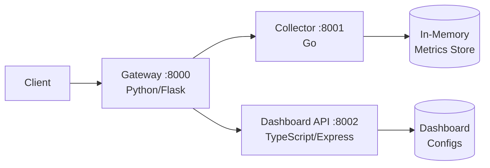

# Pulseway

Real-time microservices health monitoring platform. Pulseway aggregates health checks and metrics from distributed services into a unified dashboard API.

## Architecture



### Services

| Service | Language | Port | Description |
|---------|----------|------|-------------|
| **Gateway** | Python (Flask) | 8000 | API gateway — routes requests, aggregates health status |
| **Collector** | Go | 8001 | Ingests and stores metrics (capped ring buffer) |
| **Dashboard** | TypeScript (Express) | 8002 | CRUD API for dashboard configurations |

## Quick Start

```bash
# Clone and start all services
git clone https://github.com/mohadayo/pulseway.git
cd pulseway
cp .env.example .env
make up
```

Verify all services are running:

```bash
make status
```

## API Reference

### Gateway (`:8000`)

| Method | Endpoint | Description |
|--------|----------|-------------|
| `GET` | `/health` | Gateway health check |
| `GET` | `/api/services` | List registered services |
| `GET` | `/api/status` | Aggregated health from all services |
| `POST` | `/api/metrics` | Forward metrics to collector |

### Collector (`:8001`)

| Method | Endpoint | Description |
|--------|----------|-------------|
| `GET` | `/health` | Collector health check |
| `GET` | `/metrics` | Retrieve all stored metrics |
| `POST` | `/metrics` | Submit metrics (`{"cpu": 65.2, "memory": 1024}`) |

### Dashboard API (`:8002`)

| Method | Endpoint | Description |
|--------|----------|-------------|
| `GET` | `/health` | Dashboard health check |
| `GET` | `/dashboards` | List all dashboards |
| `POST` | `/dashboards` | Create a dashboard (`{"name": "...", "widgets": [...]}`) |
| `GET` | `/dashboards/:name` | Get dashboard by name |
| `DELETE` | `/dashboards/:name` | Delete dashboard by name |

## Usage Examples

```bash
# Check overall system status
curl http://localhost:8000/api/status | jq

# Submit metrics
curl -X POST http://localhost:8000/api/metrics \
  -H "Content-Type: application/json" \
  -d '{"cpu_percent": 42.5, "memory_mb": 2048}'

# Create a dashboard
curl -X POST http://localhost:8002/dashboards \
  -H "Content-Type: application/json" \
  -d '{"name": "production", "widgets": ["cpu", "memory", "disk"]}'

# List dashboards
curl http://localhost:8002/dashboards | jq
```

## Development

### Prerequisites

- Python 3.12+
- Go 1.22+
- Node.js 20+
- Docker & Docker Compose

### Run Tests

```bash
make test          # Run all tests
make test-gateway  # Python tests only
make test-collector # Go tests only
make test-dashboard # TypeScript tests only
```

### Linting

```bash
make lint
```

### Docker Commands

```bash
make up      # Build and start all services
make down    # Stop all services
make logs    # Tail logs from all services
make clean   # Remove containers, volumes, and images
```

## Environment Variables

See [`.env.example`](.env.example) for all configurable options.

## CI/CD

GitHub Actions runs on every push and PR to `main`:
1. Lint + test each service in parallel
2. Verify Docker Compose build

> **Note:** `.github/workflows/ci.yml` may need to be manually added after initial setup due to GitHub API restrictions on the `.github/` directory.

### CI Workflow Content

```yaml
name: CI

on:
  push:
    branches: [main]
  pull_request:
    branches: [main]

jobs:
  test-gateway:
    runs-on: ubuntu-latest
    defaults:
      run:
        working-directory: gateway
    steps:
      - uses: actions/checkout@v4
      - uses: actions/setup-python@v5
        with:
          python-version: "3.12"
      - run: pip install -r requirements.txt
      - run: flake8 --max-line-length=120 app.py
      - run: pytest -v

  test-collector:
    runs-on: ubuntu-latest
    defaults:
      run:
        working-directory: collector
    steps:
      - uses: actions/checkout@v4
      - uses: actions/setup-go@v5
        with:
          go-version: "1.22"
      - run: go vet ./...
      - run: go test -v ./...

  test-dashboard:
    runs-on: ubuntu-latest
    defaults:
      run:
        working-directory: dashboard
    steps:
      - uses: actions/checkout@v4
      - uses: actions/setup-node@v4
        with:
          node-version: "20"
      - run: npm install
      - run: npx eslint src/
      - run: npm test

  docker-build:
    runs-on: ubuntu-latest
    needs: [test-gateway, test-collector, test-dashboard]
    steps:
      - uses: actions/checkout@v4
      - run: docker compose build
```

## License

MIT
